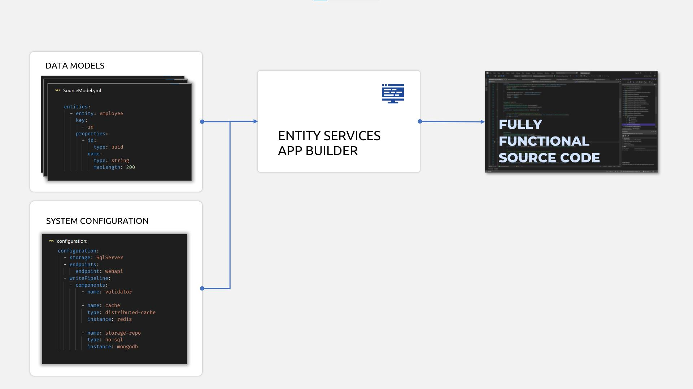
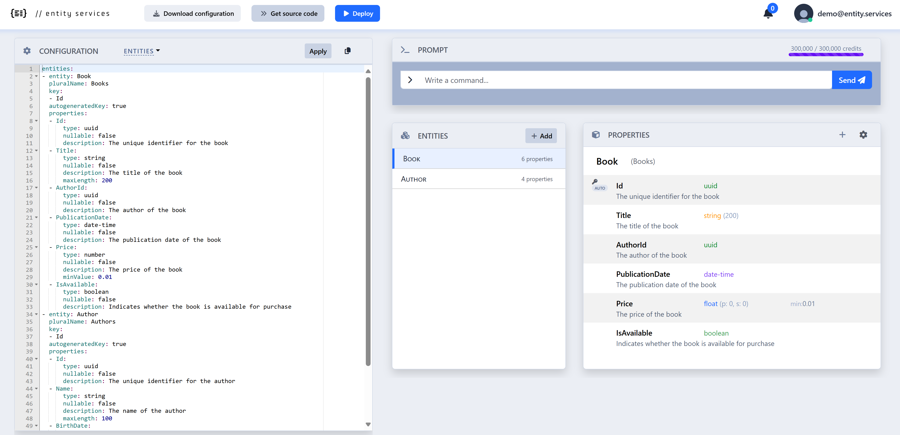
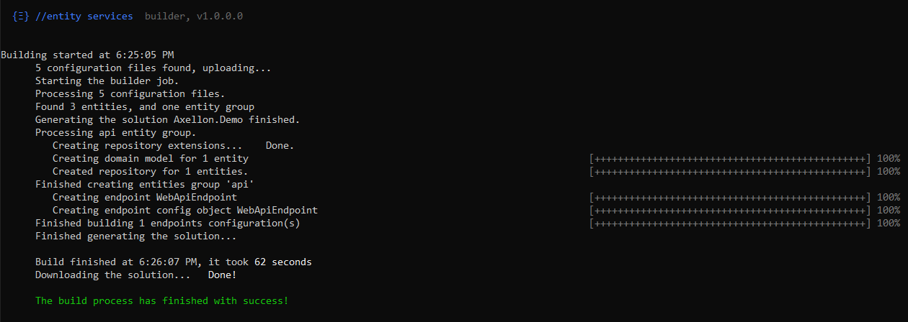
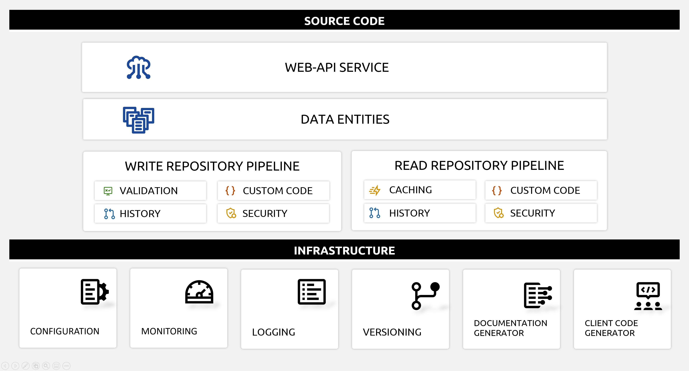

# What is //entity services

**//entity services** is a **free** tool that will help you speed up the development of enterprise .NET solutions.
It creates fully functional C# source code based on a simple configuration.

Read more about [//entity services](https://entity.services/solution) , watch [short introduction video](https://youtu.be/ksIUNwSfV5g), browse the [documentation](https://docs.entity.services/overview/) or follow the [quick start](#quickstart) instructions to try it out!



# Licensing

Generated source code is yours. You can change it as you want and use it in the commercial projects.

# Contributing

We would like to get your feedback!

We are using [discussions page](https://github.com/axlln/playground-docs/discussions) as a place to connect with other members of our community.
Ask questions you are wondering about, share ideas, engage with other community members.
Remember that this is a community we build together 💪.

# Quickstart

Here is the development process with _//entity services_:

1. [Install](#1-install-net-tool-es-builder) .NET tool `es-builder`
2. [Describe models and define which components](#2-define-solution-components) the solution should contain
3. Start `es-builder` to [generate the source code](#3-start-source-code-builder)
4. If necessary, [customize]() generated source code
5. [Build and run](#5-build-and-run-your-solution) your solution
6. [Use generated OpenAPI client and .http scripts](#6-test-your-application) to easily test your application

## 1. Install .NET tool `es-builder`

Make sure that you have [.NET 6 installed](https://docs.microsoft.com/en-us/dotnet/core/install/) on your system.

Add Entity Services NuGet Source:

```
dotnet nuget add source https://pkgs.dev.azure.com/entityservices/nugets-lite/_packaging/es-lite/nuget/v3/index.json --name entityservices 
```

Install Entity Services Builder Cli:

```
dotnet tool install es-builder-cli -g
```

where flag `-g` will install it globally.

## 2. Define solution components

`es-builder` tool will create source code based on yaml files that define:

* configuration of entities,
* selected components for repository (Entity Framework, Azure Cosmos Db, etc.) and
* configuration of project naming and files structure.

### Entity Services Portal

The easiest way to define entities is using [//entity services portal](https://portal.entity.services).  The portal provides forms to manage entities and their properties.  The AI enhanced prompt helps creating multiple entities models in few seconds.



The portal comes pre-populated with a simple example of entities for a bookstore solution but you can easily create the entities that fit your needs.

Examples of prompts:

* `Clear all  ` (clears the current content)
* `Create entities for Pub management solution`
* `I am creating an app for NHS. Created entities should include Hospital, Patient and Doctor`
* `Change Doctor entity to Physician`

Copy the generated yaml that describes the entities and save it as local file(s) into your working folder or subfolder.  Use extension `.yml`.

You will also need to define the components of the solution. The easiest way is to choose one of the configuration examples ([entity-framework-quickstart.yml](examples/3-entity-framework-quickstart.yml) if you want to use Sql Server or [mongodb-quickstart.yml ](examples/mongodb-quickstart.yml)for NoSql database) in this repo and replace the entities with the one you created.

In folder `\examples` of this repo you will find examples of configuration.  Here is a snippet you can use:

```yml
solutionName: "Axellon.Simple"
dataApi:
    entityGroups:
      - group: default
        enableHistory: false
        useGroupFolder: true
        readComponents:
          - type: MongoDbComponent
        writeComponents:
          - type: ValidationComponent
          - type: MongoDbComponent
        endpoints:
          - type: WebApiEndpoint

```

## 3. Start source code builder

Before using other `es-builder` CLI commands, you need to sign in.

Run the `login` command:

```
es-builder login
```

If the CLI can open your default browser, it will open Entity Services page for login or sign-up.

After successful login, start the build process with command:

```
es-builder build
```

When build command is started, it will use `.yml` configuration file(s) to create source code and store solution files in defined location.



In aproximatelly 60 seconds you will have complete source code of the solution downloaded in your folder.

## 4. Customize generated source code

Use your favorite development IDE and customize generated source code per your requirements.

Here are main **components** of generated solution:



## 5. Build and run your solution

Right-click on `*.WebApi` project and select option `"Set as Startup Project"`.

Now you can build and run your solution.

### Enjoy coding things that matter and run your new solution!

## 6. Easily test your application with generated scripts

### Http files

WebApi project contains folder `HttpEndpoints` with _.http_ files. Their purpose is to allow executing HTTP commands via Visual Studio Code extension [REST Client](https://marketplace.visualstudio.com/items?itemName=humao.rest-client). Generated _.http_ files can also be used in  Visual Studio or Rider environments, with minimal adjustments.

### Open API Web UI

Based on default settings in app.settings, upon start of WebApi project, web browser will be opened with OpenApi UI at the route `/interactive-docs`.

# Need help?

* [Documentation](https://docs.entity.services)
* [Contact us](https://entity.services/#contactAnchor)
