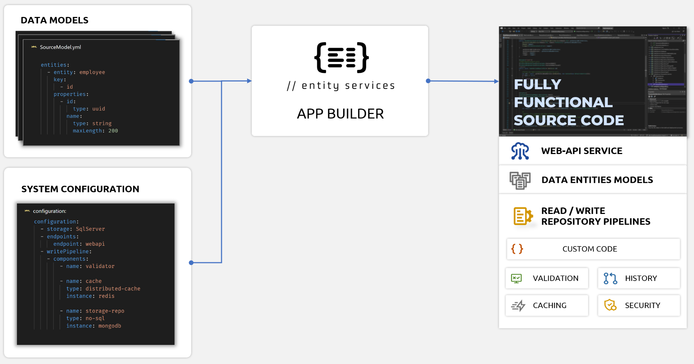

# What is //entity services

**//entity services** is a tool that will help you speed up the development of enterprise .NET solutions.

Using this FREE version, in just few minutes you can create fully functional C# source code based on a simple configuration.

**Generated .NET solution includes**:

*  **Data layer projects** that follow repository pattern with read and write pipelines composed of components for validation, caching, security and with various storage options (SQL Server, MongoDB,..),
*  **Data-centric entities models**,

*  **Web API project** that exposes endpoints with standard CRUD methods with versioning, API documentation and .http files for testing

The solution follows industry best practices, it is designed to be easily customizable and deployed to any cloud or on premisses.

Read more about [//entity services](https://entity.services/solution) , watch [short introduction video](https://youtu.be/ksIUNwSfV5g), browse the [documentation](https://docs.entity.services/overview/) or follow the [quick start](#quickstart) instructions to try it out!



# Licensing

Generated source code is yours. You can change it as you want and use it in the commercial projects.

# Contributing

We would like to get your feedback!

We are using [discussions page](https://github.com/axlln/es-quick-start/discussions) as a place to connect with other members of our community.
Ask questions you are wondering about, share ideas, engage with other community members.
Remember that this is a community we build together 💪.

# Quickstart

Here is the development process with _//entity services_:

1. [Install](#1-install-net-tool-es-builder) .NET tool `es-builder`
2. [Describe models and define solution components](#2-define-solution-components)
3. Start `es-builder` to [generate the source code](#3-start-source-code-builder)
4. If necessary, [customize]() generated source code
5. [Build and run](#5-build-and-run-your-solution) your solution
6. [Use generated OpenAPI client and .http scripts](#6-test-your-application) to easily test your application

## 1. Install .NET tool `es-builder`

Make sure that you have [.NET 6 installed](https://docs.microsoft.com/en-us/dotnet/core/install/) on your system.

Add Entity Services NuGet Source:

```
dotnet nuget add source https://pkgs.dev.azure.com/entityservices/nugets-lite/_packaging/es-lite/nuget/v3/index.json --name entityservices 
```

Install Entity Services Builder Cli:

```
dotnet tool install es-builder-cli -g
```

where flag `-g` will install it globally.

## 2. Define models and solution components

`es-builder` tool will create source code based on YAML files that define:

* definition of entities,
* selected components for repository (Entity Framework, Azure Cosmos Db, etc.) and
* configuration of project naming and files structure.

You can choose one of the configuration examples from this repo, such as [examples/entity-framework-quickstart.yml](examples/3-entity-framework-quickstart.yml) if you want to use Sql Server, or [examples/mongodb-quickstart.yml ](examples/mongodb-quickstart.yml) for NoSql database and copy it in your local folder.

If you want to create your own data model definitions, continue reading about the Entity Services Portal, otherwise skip to [the next step](#3-start-source-code-builder).

### Entity Services Portal

The easiest way to define entities is using [//entity services portal](https://portal.entity.services).  The portal provides forms to manage entities and their properties.  The AI enhanced prompt helps creating multiple entities models in few seconds.


The portal comes pre-populated with a simple example of entities for a bookstore solution, but you can easily create the entities that fit your needs.

Examples of prompts:

* `Clear all` (clears the current content)
* `Create entities for Pub management solution`
* `I am creating an app for NHS. Created entities should include Hospital, Patient and Doctor`
* `Rename entity Doctor to Physician`
* `Set max length of all string properties of entity Physician to 200`

Copy the generated YAML that describes the entities and save it as local file(s) into your working folder or subfolder.  Use the extension `.yml`.

You will also need to define the components of the solution. The easiest way is to choose one of the configuration examples from this repo, such as [examples/entity-framework-quickstart.yml](examples/3-entity-framework-quickstart.yml) if you want to use Sql Server, or [examples/mongodb-quickstart.yml ](examples/mongodb-quickstart.yml) for NoSql database.  Make sure to replace the entities with the one you created.

In folder `/examples` of this repo, you will find other examples of configuration.  Here is a snippet you can use:

```yml
solutionName: "Axellon.Simple"
dataApi:
    entityGroups:
      - group: default
        enableHistory: false
        useGroupFolder: true
        readComponents:
          - type: MongoDbComponent
        writeComponents:
          - type: ValidationComponent
          - type: MongoDbComponent
        endpoints:
          - type: WebApiEndpoint

```

## 3. Start source code builder

Before using `es-builder` CLI commands, you need to sign in.

Run the `login` command:

```
es-builder login
```

If the CLI can open your default browser, it will open Entity.Services page for login or sign-up.

After successful login, start the build process with command:

```
es-builder build
```

When build command is started, it will use `.yml` configuration file(s) to create source code and store solution files in defined location.  The default location it the folder where you started `es-builder`.


In aproximatelly 60 seconds you will have complete source code of the solution downloaded in your folder.

Here are the main **components** of the generated solution:


## 4. Customize generated source code

Use your favorite development IDE and customize generated source code per your requirements.

## 5. Build and run your solution

Make sure to set Web API project as your startup project.
For example, if you are using Visual Studio, right-click on `*.WebApi` project and select option `"Set as Startup Project"`.

To be able to test the solution you will need a data storage. Depending on which component you chose, you could use MongoDb or Sql Server.

### **MongoDb**

To use MongoDb database you have to provide a connection string and create the collections for your entities in the database.

**Connection string**

The application will take the connection string from environment variable, appsettings file or user secrets file.

The connection string variable name should be `ConnectionStrings__MongoDBConnectionString`

The example of the connection string for Azure CosmosDb Mongo database

```
mongodb://my-demo-cosmos-account:<-secret->@my-demo-cosmos-account.mongo.cosmos.azure.com:10255/our-mongo?ssl=true&replicaSet=globaldb&retrywrites=false&maxIdleTimeMS=120000&appName=@my-demo-cosmos-account@
```

Replace <-secret-> with your secret and don't forget to restart the Visual Studio to pickup the new env variable.

**Collections**

The database has to contain a collection for each of your entities. For example, if you have defined "Asset" and "Commodity" entity in your configuration, the collections with the same names has to be created in the database.

**CLI command**

If you have a Azure subscription, you could use our CLI command to create a free database, collections and set up the connection string in the environment variable as described [here](https://docs.entity.services/es-builder-cli/commands/#azure-cosmosdb-mongodb).

### **Sql Server**

To use Sql Server database you have to provide a connection string and create the tables for your entities in the database.

**Connection string**

The application will take the connection string from environment variable, appsettings file or user secrets file.

The connection string variable name should be ` ConnectionStrings__SqlConnectionString`

**Database Tables**

To run the application that uses Sql Server as a storage, you will need to create the tables that match your entity definitions.

The easies way to create those tables in by using migration scripts and the Entity Framework migration tool, as described [here](https://docs.entity.services/components/entity-framework/#migration-scripts).

Here is an example of the commands you have to run to create the migrations and update the database for one db context (you will need to run them for each Db context in your solution).

```
dotnet ef migrations add Initial_migration 
	--output-dir "C:\demo\Axellon.SimpleSql\src\Axellon.SimpleSql.Repository\Assets\Migrations" 
	--project "C:\demo\Axellon.SimpleSql\src\Axellon.SimpleSql.Repository\Axellon.SimpleSql.Repository.csproj" 
	--context AssetEntityContext 
	-- --cs "Data Source=(localdb)\MSSQLLocalDB;Initial Catalog=Test;Integrated Security=True;Connect Timeout=30;Encrypt=False;Trust Server Certificate=False;Application Intent=ReadWrite;Multi Subnet Failover=False"


dotnet ef database update 
	--project C:\demo\Axellon.SimpleSql\src\Axellon.SimpleSql.Repository\Axellon.SimpleSql.Repository.csproj 
	--context AssetEntityContext 
	-- --cs "Data Source=(localdb)\MSSQLLocalDB;Initial Catalog=Test;Integrated Security=True;Connect Timeout=30;Encrypt=False;Trust Server Certificate=False;Application Intent=ReadWrite;Multi Subnet Failover=False"
```

Now you can build and run your solution.

### Enjoy coding things that matter and run your new solution!

## 6. Easily test your application with generated scripts

### Http files

WebApi project contains folder `HttpEndpoints` with _.http_ files. Their purpose is to allow executing HTTP commands via Visual Studio Code extension [REST Client](https://marketplace.visualstudio.com/items?itemName=humao.rest-client). Generated _.http_ files can also be used in  Visual Studio or Rider environments, with minimal adjustments.

### Open API Web UI

Based on default settings in `app.settings`, upon start of WebApi project, web browser will be opened with OpenApi UI at the route `/interactive-docs`.

# Need help?

* [Documentation](https://docs.entity.services)
* [Contact us](https://entity.services/#contactAnchor)
